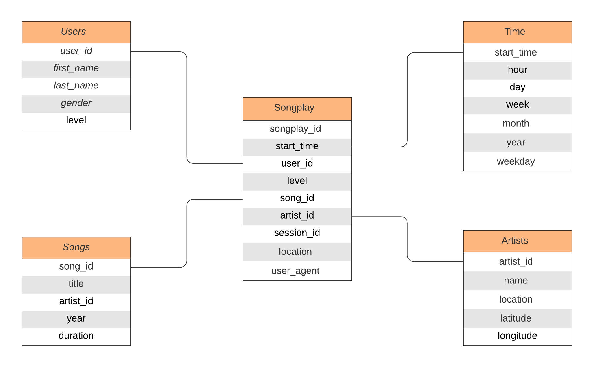

# Project 3
## Data Warehouse

### PROJECT SUMMARY
This project was tasked with building an ETL pipeline that extracts data from S3, stages it in Redshift, and transforms data into a set of dimensional tables for the analytics team to continue finding insights in what songs their users are listening to.

### PROJECT SCHEMA
Initially, data from JSON Files were transferred to staging tables and then to the OLAP tables.
Star Schema was used for the development of the database.
4 Dimension tables and a single fact table was used.
The ER Diagram for the project -



### PROJECT FILES

1. create_tables.py - Python script used to connect to the Redshift Cluster. It returns the connection and cursor. It drops the tables in the database if previously created. The script then makes all the tables with the help of queries in sql_queries.py. Finally, the script closes the connection. To execute this file, run the following command in Terminal - ``` python create_tables.py ```

2. sql_queries.py - The script that specifies all the queries required in the project. For Example, CREATE TABLE Queries, DROP TABLE Queries.

3. etl.py - This is the script for creating the main ETL Pipeline. This file creates a connection to the Redshift Cluster, and then initially copies the data using COPY commands from JSON files to staging tables, and then inserts data into the main tables with the help of staging tables. To execute this file, run the following command in Terminal - ``` python etl.py ```

4. dwh.cfg - This file contains all the required constants to used in the project.

Thankyou :sparkles: